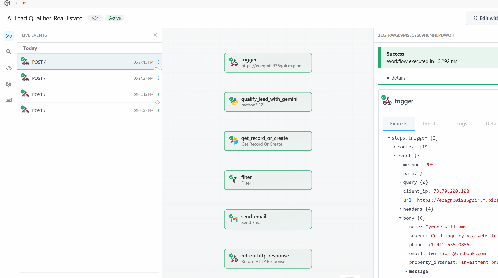
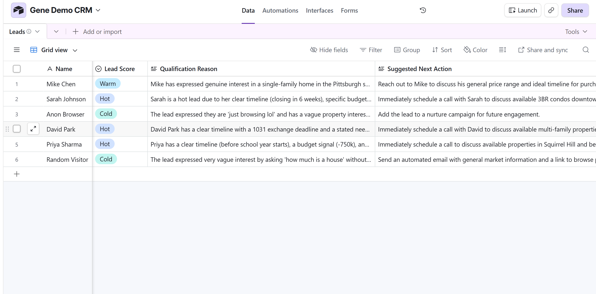
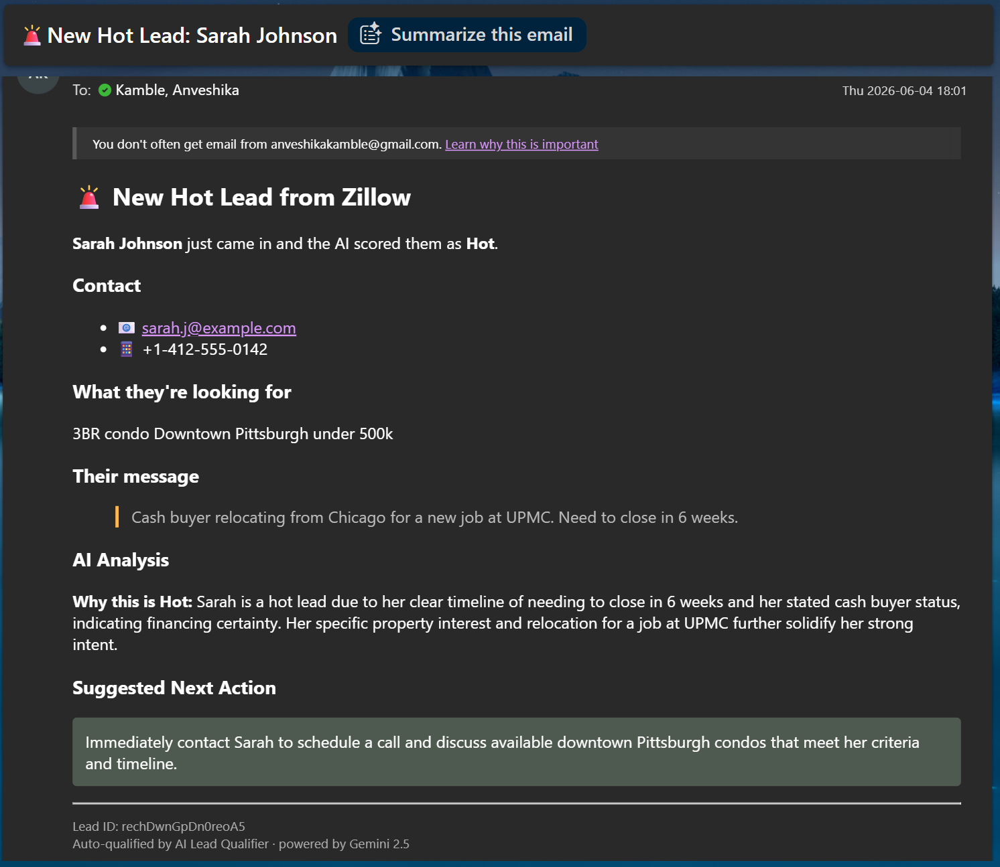
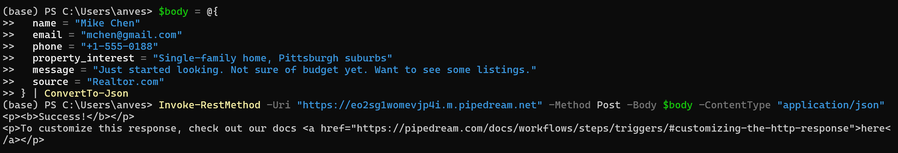

# AI Lead Qualifier for Real Estate

A webhook-triggered workflow that qualifies inbound real estate leads in real time using Google Gemini (Hot / Warm / Cold), writes structured records to an Airtable CRM, and sends a real-time email alert to a sales rep for Hot leads only ( mirroring the lead-qualification, CRM-update, and notification pipeline used by modern AI sales platforms).

---

## Try it yourself

Clone this workflow into your own Pipedream account with one click:

[Open in Pipedream](https://pipedream.com/new?h=tch_VdfeLy)

After cloning, you will need to:

1. Add a GEMINI API KEY in Pipedream Settings then Environment Variables
2. Connect your Airtable account in the Airtable step
3. Update the Base ID and Table name to point to your own Airtable Leads table
4. Deploy, then POST a lead to your new webhook URL

---

## Architecture

The workflow has six steps:

1. Webhook trigger - receives a POST with lead data
2. Gemini qualification step (Python) - calls Gemini 2.5 Flash-Lite for Hot/Warm/Cold scoring
3. Airtable step - writes the qualified lead to your CRM
4. Filter - only Hot leads continue to the notification step
5. Gmail step - sends a real-time email alert with the AI's reasoning and suggested next action
6. HTTP response step - returns lead ID, score, and next action as JSON

## Stack

- Pipedream - workflow orchestration (free tier)
- Google Gemini 2.5 Flash-Lite - LLM with structured JSON output
- Airtable - CRM destination
- Python - custom logic, retry with exponential backoff, graceful JSON-parse fallback

## What it does

1. Receives a lead payload from any source (Zillow, Realtor, website form, etc.) via webhook
2. Prompts Gemini to classify the lead as Hot, Warm, or Cold, with a reason and suggested next action
3. Writes the structured record to Airtable in real time
4. For Hot leads only: sends a real-time email alert to the sales rep with the lead's info, AI reasoning, and recommended next action
5. Returns the lead ID, score, and recommended next action to the caller as JSON

## Screenshots

Pipedream workflow canvas:



Qualified leads in Airtable:



Real-time email alert sent for a Hot lead:



Example request and response:



## Example request (PowerShell)

```
$body = Get-Content test-payloads/hot-lead.json -Raw
Invoke-RestMethod -Uri "https://your-webhook.m.pipedream.net" -Method Post -Body $body -ContentType "application/json"
```

## Example response

```
{
  "success": true,
  "lead_id": "recHNzStpKlE4v3LJ",
  "score": "Hot",
  "next_action": "Call Sarah within 24 hours to discuss closing timeline and verify proof of funds."
}
```

## Repo contents

- code/qualify lead with gemini Python file — the Gemini step with input validation, prompt design, retry with exponential backoff, and graceful JSON-parse fallback
- screenshots folder — demo screenshots of the workflow, Airtable, email notification and a sample request
- test-payloads folder — three sample lead JSONs (hot, warm, cold) you can POST to test

## Project structure

The logic is split into testable modules so the Pipedream handler stays thin:

- code/lead_qualifier/prompts.py        — prompt templates
- code/lead_qualifier/gemini_client.py  — Gemini API client with retry-on-rate-limit
- code/lead_qualifier/parsing.py        — JSON parsing with graceful fallback
- code/lead_qualifier/validators.py     — input validation
- code/qualify_lead_with_gemini.py      — thin Pipedream handler
- code/local_test.py                    — run the qualifier locally
- tests/                                — pytest suite (11 tests)

Run the tests:
    pip install -r requirements.txt
    pytest tests/ -v
    
## Engineering decisions worth noting

- Model migration: originally built on gemini-2.0-flash, which Google deprecated mid-build. Migrated to gemini-2.5-flash-lite — a reminder that model-agnostic code matters in production.
- Rate limit handling: wrapped the Gemini call in retry with exponential backoff (2s, 4s, 8s) so the workflow degrades gracefully when free-tier quota hits.
- Robust JSON parsing: LLMs occasionally return malformed JSON. The code falls back to a flagged Cold-plus-manual-review record rather than crashing the pipeline.
- Secrets handling: API keys live in Pipedream environment variables, not in code.
- Input validation: bad webhooks fail with a clear error message instead of an opaque undefined-property error.
