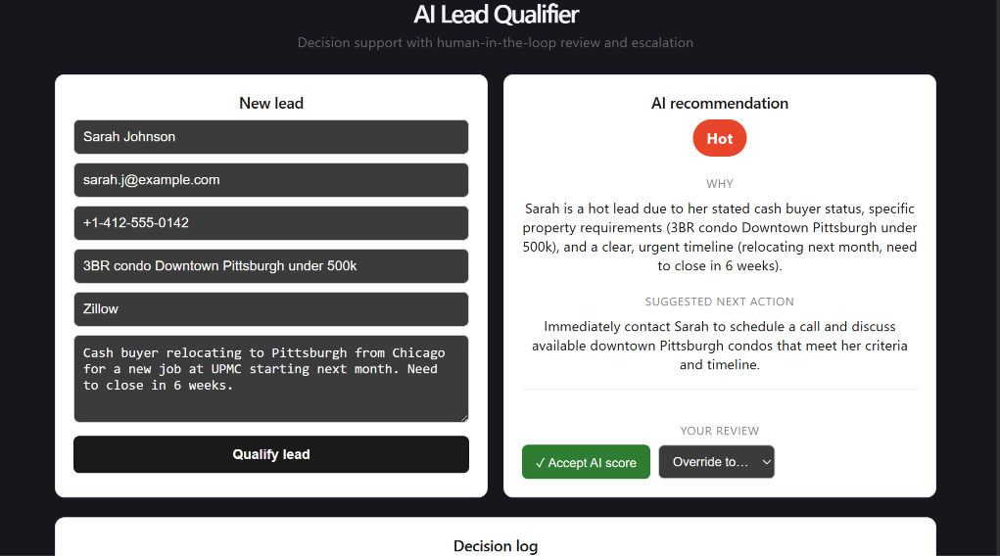
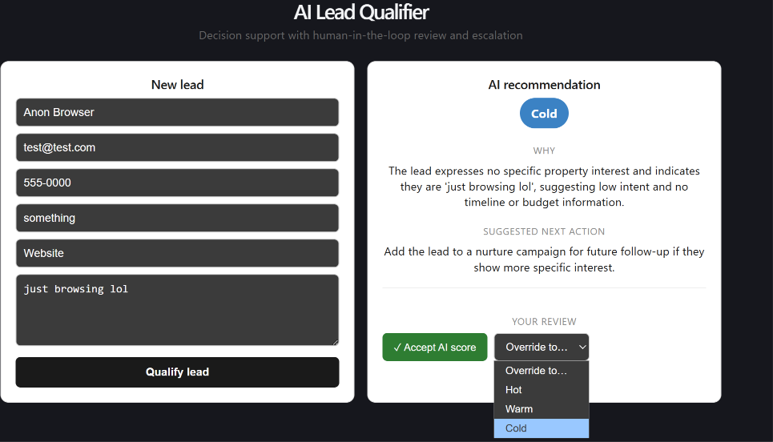

# AI Lead Qualifier — Web App

A full-stack GenAI web application that qualifies inbound real estate leads in real time and puts a human in the loop. A user submits a lead, an LLM scores it Hot / Warm / Cold with reasoning and a suggested next action, and the user can accept, override, or escalate the decision.

Built as a product-focused companion to the [lead qualification backend](../README.md) — the same modular `lead_qualifier` logic powers both an automated pipeline and this user-facing app.

## What it does

- Takes a lead (name, contact, message, source) through a simple form
- Uses an LLM to classify it **Hot / Warm / Cold**, with the reasoning and a recommended next action
- Shows a **human-in-the-loop review panel**: accept the AI score, override it, or flag low-confidence cases for escalation
- Logs each decision, tracking whether the AI's call was accepted or overridden

## Screenshots

Hot lead — AI recommendation with reasoning and next action:

Cold lead — the model correctly downgrades a low-intent inquiry:

Human-in-the-loop review — accept or override the AI's decision:

## Stack

- **Frontend:** React (Vite)
- **Backend:** FastAPI (`api.py`), reusing the shared `lead_qualifier` package
- **Model:** Google Gemini

## Why it's designed this way

The product decisions matter as much as the code:

- **Human-in-the-loop, not full automation.** In a real sales team, reps won't trust an opaque AI score. Letting them accept or override keeps a human accountable — and those overrides are a natural source of feedback for improving the system.
- **Confidence and escalation.** Low-confidence decisions surface an escalation prompt rather than silently auto-deciding, because in a business workflow an uncertain call should route to a person.
- **Decision support, not a black box.** The app always shows *why* — the reasoning and a suggested next action — so the score is explainable, not just a label.

## Running locally

Backend (from the project root):
pip install fastapi uvicorn
uvicorn api:app --reload --port 8000

Frontend:
cd lead-qualifier-ui
npm install
npm run dev

The app runs at `http://localhost:5173` and calls the API at `http://localhost:8000`.

Requires a `GEMINI_API_KEY` environment variable set where the backend runs.
